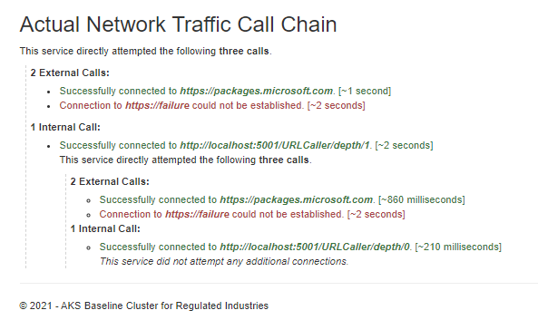

# AKS Endpoint Caller

It is a micro service which calls a set of Endpoints collecting the results.   
There are two kind of Endpoints:
1. External: These are URLs with unknown result
1. Recursive: These are URLs where instances of this micro-service is deployed, so the result format is well known 

It is a very simple application that allows us to test communication and lack of it.

It is mainly useful to test networking policies. It was created to help us on AKS Regulated Cluster, but it can be used base on your needs.

## Application
It is a basic .Net 5.0 web application. It was created using Visual Studio 2019.

### Build docker images
Before deploying on Kubernetes we need to create the docker image. There is a DockerFile as part of the solution.

```bash
cd SimpleChainApi
docker build -f ".\SimpleChainApi\Dockerfile" --force-rm -t aks-endpoint-caller:1.0 --target final .
```

If you are using Azure Kubernetes Service you need to [push your image on a Azure Container Registry](https://docs.microsoft.com/en-us/azure/container-registry/container-registry-get-started-docker-cli)

### Kubertnes deploy

It is an example of a deployment on AKS.
 
```yml
apiVersion: v1
kind: Service
metadata:
  name: ingress-endpoint-service
  labels:
    app: ingress-endpoint-service
spec:
  type: LoadBalancer
  ports:
  - port: 80
    targetPort: 8080
    name: ingress-endpoint-http
  selector:
    app: ingress-endpoint 
---
apiVersion: apps/v1
kind: Deployment
metadata:
  name: ingress-endpoint
spec:
  selector:
    matchLabels:
      app: ingress-endpoint
  replicas: 1
  template:
    metadata:
      labels:
        app: ingress-endpoint
    spec:
      containers:
      - name: ingress-endpoint
        image: aks-endpoint-caller:1.0
        ports:
        - containerPort: 8080
        env:
        - name: SELF_HOSTS_DEPENDENCIES
          value: ""
        - name: EXTERNAL_DEPENDENCIES
          value: "https://whatismyip.io/"
        - name: "DEPTH"
          value: "1"
```
We need to define some environment variables:
1. `EXTERNAL_DEPENDENCIES` - These are URLs with an unknown result; as a comma-separated list
1. `SELF_HOSTS_DEPENDENCIES` - These are URLs where instances of this micro service is deployed, so the result format is well known; as a comma-separated list.
1. `DEPTH` - This value is for doing the recursive calls. The default is `0`, meaning no dependencies are called. If the value is larger than `0` the dependencies are call, and the recursive dependencies are called using (`DEPTH-1`). This parameter avoid infinite calls. This parameter is needed to be set only in the entry point of micro services components.

### Example
We can create the configuration which is useful for the situation we want to test. An example setup is:
1. Ingress Endpoint is the starting point, and calls: https://www.microsoft.com, https://serviceA, https://serviceB,  https://serviceC
1.  serviceA calls: https://www.microsoft.com, https://serviceA, https://serviceB, https://serviceC
1.  serviceB calls: https://www.microsoft.com, https://serviceA, https://serviceB, https://serviceC
1.  serviceC calls: https://www.microsoft.com, https://serviceA, https://serviceB, https://serviceC   


Some arrows are not display as draw simplification
### Result Page
Navigating the root of the ingress micro service endpoint and it will throws the test and shows a result like:



## Contributions

Please see our [contributor guide](./CONTRIBUTING.md).

This project has adopted the [Microsoft Open Source Code of Conduct](https://opensource.microsoft.com/codeofconduct/). For more information see the [Code of Conduct FAQ](https://opensource.microsoft.com/codeofconduct/faq/) or contact <opencode@microsoft.com> with any additional questions or comments.

With :heart: from Microsoft Patterns & Practices, [Azure Architecture Center](https://aka.ms/architecture).